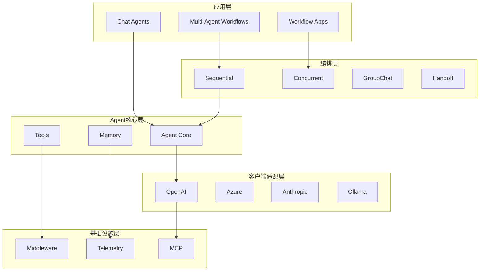
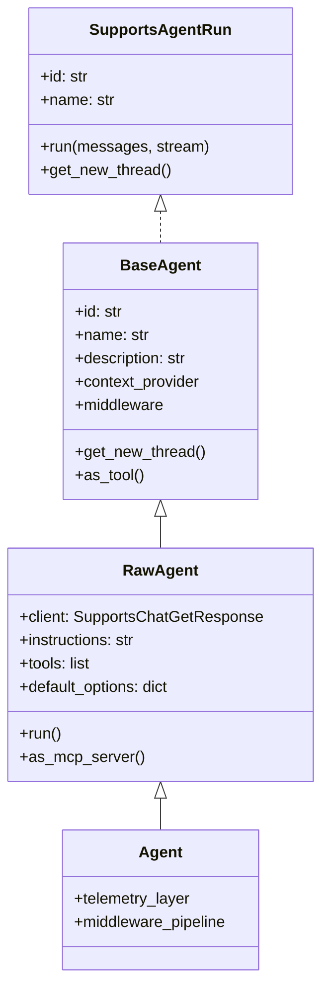
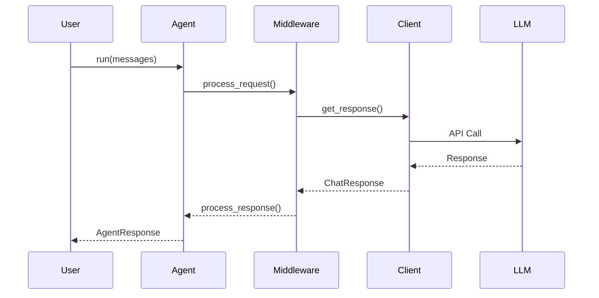
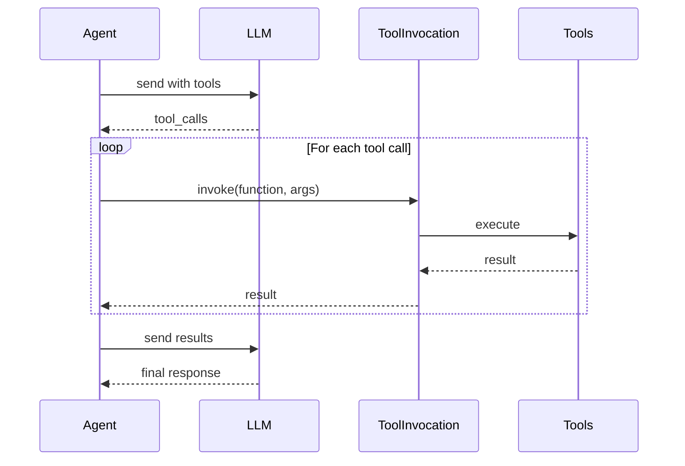
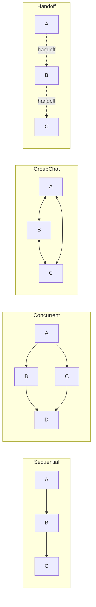

# Microsoft Agent Framework - 架构图索引

## 架构图文件说明

本目录包含 Microsoft Agent Framework 的技术架构图，配合主报告阅读。

## 文件列表

- `architecture-overview.png` - 整体架构分层图
- `agent-class-diagram.png` - Agent 类继承图
- `module-dependency.png` - 模块依赖关系图
- `orchestration-flow.png` - 编排流程图

## 查看方式

架构图使用 Mermaid/PlantUML 语法定义，可在支持的工具中渲染。

---

## 架构图 Mermaid 源码

### 1. 整体架构分层

### 2. Agent 类继承体系

### 3. 请求处理流程

### 4. 工具调用流程

### 5. 编排模式对比

---

## 架构要点速览

### 核心设计原则

1. **协议优先** - 使用 Python Protocol 实现灵活扩展
2. **分层清晰** - 核心/编排/应用三层分离
3. **类型安全** - 泛型参数确保编译时检查
4. **异步原生** - 全链路 async/await 支持

### 关键抽象

| 抽象 | 职责 |
|------|------|
| SupportsAgentRun | Agent 行为协议 |
| SupportsChatGetResponse | 客户端能力协议 |
| BaseChatClient | 客户端抽象基类 |
| FunctionTool | 工具封装 |
| AgentThread | 对话状态管理 |

---

*生成时间: 2026-02-12*
